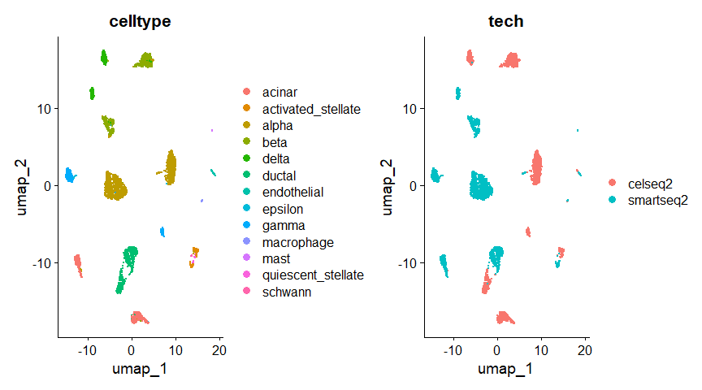
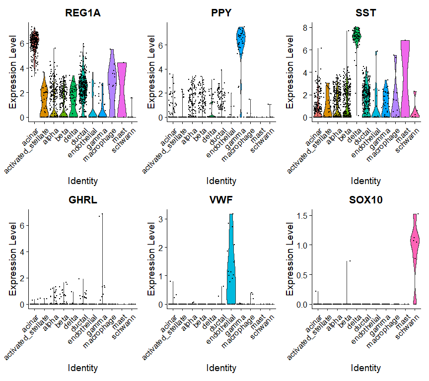

Mapping and Annotating Query Datasets
================
Matthew Esqueda
2024-01-20

## Single-cell reference mapping

Build an integrated reference and then demonstrate how to leverage this
reference to annotate new query datasets. This reference can be used to
analyze additional query datasets through tasks like cell type label
transfer and projecting query cells onto reference UMAPS. This does not
require correction of the underlying raw query data and can be an
efficient strategy if a high quality reference is available.

## Data Processing

For the purposes of this example, we’ve chosen human pancreatic islet
cell datasets produced across four technologies, CelSeq (GSE81076)
CelSeq2 (GSE85241), Fluidigm C1 (GSE86469), and SMART-Seq2
(E-MTAB-5061). The metadata contains the technology (`tech` column) and
cell type annotations (`celltype` column) for each cell in the four
datasets.

``` r
library(Seurat)
library(SeuratData)
library(ggplot2)
```

``` r
InstallData("panc8")
```

Use a subset of tecnhnologies to contruct a reference. Then map the
remaining datasets onto this reference. Start be selecting cells from
our four technologies, and perform analysis without integration.

``` r
panc8 <- LoadData("panc8")
table(panc8$tech)
```

    ## 
    ##     celseq    celseq2 fluidigmc1     indrop  smartseq2 
    ##       1004       2285        638       8569       2394

``` r
# use data from 2 technologies for the reference
pancreas.ref <- subset(panc8, tech %in% c("celseq2", "smartseq2"))
pancreas.ref[["RNA"]] <- split(pancreas.ref[["RNA"]], f = pancreas.ref$tech)

# pre-process dataset (without integration)
pancreas.ref <- NormalizeData(pancreas.ref)
pancreas.ref <- FindVariableFeatures(pancreas.ref)                            
pancreas.ref <- ScaleData(pancreas.ref)                            
pancreas.ref <- RunPCA(pancreas.ref)                              
pancreas.ref <- FindNeighbors(pancreas.ref)
pancreas.ref <- FindClusters(pancreas.ref)
```

    ## Modularity Optimizer version 1.3.0 by Ludo Waltman and Nees Jan van Eck
    ## 
    ## Number of nodes: 4679
    ## Number of edges: 156599
    ## 
    ## Running Louvain algorithm...
    ## Maximum modularity in 10 random starts: 0.9097
    ## Number of communities: 15
    ## Elapsed time: 0 seconds

``` r
pancreas.ref <- RunUMAP(pancreas.ref, dims = 1:30)
DimPlot(pancreas.ref, group.by = c("celltype", "tech"))
```



Integrate the datasets into a shared reference.

``` r
pancreas.ref <- IntegrateLayers(object = pancreas.ref, method = CCAIntegration, orig.reduction = "pca",
                                new.reduction = "integrated.cca", verbose = FALSE)
pancreas.ref <- FindNeighbors(pancreas.ref, reduction = "integrated.cca", dims = 1:30)
pancreas.ref <- FindClusters(pancreas.ref)
```

    ## Modularity Optimizer version 1.3.0 by Ludo Waltman and Nees Jan van Eck
    ## 
    ## Number of nodes: 4679
    ## Number of edges: 190152
    ## 
    ## Running Louvain algorithm...
    ## Maximum modularity in 10 random starts: 0.8680
    ## Number of communities: 15
    ## Elapsed time: 0 seconds

``` r
pancreas.ref <- RunUMAP(pancreas.ref, reduction = "integrated.cca", dims = 1:30)
DimPlot(pancreas.ref, group.by = c("celltype", "tech"))
```


## Cell type classification using an integrated reference

After finding anchors, use `TransferData()` function to classify the
query cells based on reference data (a vector of reference cell type
labels). `TrasnferData()` returns a matrix with predicted IDs and
prediction scores, which we can add to the query metadata.

``` r
# select two technologies for the query datasets
pancreas.query <- subset(panc8, tech %in% c("fluidigmc1", "celseq"))
pancreas.query <- NormalizeData(pancreas.query)
pancreas.anchors <- FindTransferAnchors(reference = pancreas.ref, query = pancreas.query, dims = 1:30,
                                        reference.reduction = "pca")
predictions <- TransferData(anchorset = pancreas.anchors, refdata = pancreas.ref$celltype, dims = 1:30)
pancreas.query <- AddMetaData(pancreas.query, metadata = predictions)
```

Because we have the original label annotations from our full integrated
analysis, we can evaluate how well our predicted cell type annotations
match the full reference.

``` r
pancreas.query$prediction.match <- pancreas.query$predicted.id == pancreas.query$celltype
table(pancreas.query$prediction.match)
```

    ## 
    ## FALSE  TRUE 
    ##    63  1579

To verify this further, we can examine some canonical cell type markers
for specific pancreatic islet cell populations. Note that even though
some of these cell types are only represented by one or two cells
(e.g. epsilon cells), we are still able to classify them correctly.

``` r
table(pancreas.query$predicted.id)
```

    ## 
    ##             acinar activated_stellate              alpha               beta 
    ##                262                 39                436                419 
    ##              delta             ductal        endothelial              gamma 
    ##                 73                330                 19                 41 
    ##         macrophage               mast            schwann 
    ##                 15                  2                  6

``` r
VlnPlot(pancreas.query, c("REG1A", "PPY", "SST", "GHRL", "VWF", "SOX10"), group.by = "predicted.id")
```



## Unimodal UMAP Projection

Enable projection of a query onto the reference UMAP. Compute the
reference UMAP model and then calling `MapQuery()` instead of
`TransferData()`.

``` r
pancreas.ref <- RunUMAP(pancreas.ref, dims = 1:30, reduction = "integrated.cca", return.model = TRUE)
pancreas.query <- MapQuery(anchorset = pancreas.anchors, reference = pancreas.ref, query =  pancreas.query,
    refdata = list(celltype = "celltype"), reference.reduction = "pca", reduction.model = "umap")
```

Visualize the query cells alongisde our reference.

``` r
p1 <- DimPlot(pancreas.ref, reduction = "umap", group.by = "celltype", label = TRUE, label.size = 3,
    repel = TRUE) + NoLegend() + ggtitle("Reference annotations")
p2 <- DimPlot(pancreas.query, reduction = "ref.umap", group.by = "predicted.celltype", label = TRUE,
    label.size = 3, repel = TRUE) + NoLegend() + ggtitle("Query transferred labels")

p1 + p2
```


