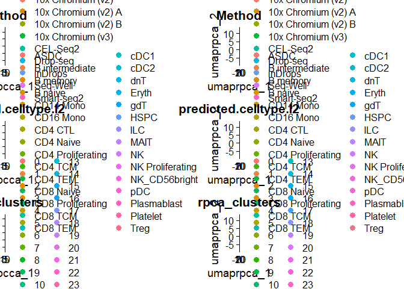

Integrative Analysis
================
Matthew Esqueda
2024-01-18

## Introduction

Integration of single-cell datasets, for example across experimental
batches, donors, or conditions, is often an important step in scRNA-seq
workflows. Itegrative analysis can help to match shared cell types and
states across datasets, which can boost statistical power, and most
importantly, facilitate accurate comparative analysis across datasets.
Here, a [dataset of human PBMC profiled with seven different
technologies](https://singlecell.broadinstitute.org/single_cell/study/SCP424/single-cell-comparison-pbmc-data),
profiled as part of a systematic comparative analysis (`pbmcsa`). The
data is available as part of the
[SeuratData](https://github.com/satijalab/seurat-data) package.

## Layers in the Seurat v5 object

Seurat v5 assays store data in layers. These layers can store raw,
un-normalized (`layer='counts'`), normalized data (`layer='data'`), or
z-scored/variance-stabilized data (`layer='scale.data'`). Load the data,
remove low-quality cells, and obtain predicted cell annotations with the
[Azimuth
pipeline](https://satijalab.github.io/azimuth/articles/run_azimuth_tutorial.html).

``` r
# load in pbmc systematic comparative analysis dataset
obj <- LoadData("pbmcsca")
obj <- subset(obj, nFeature_RNA > 1000)
obj <- RunAzimuth(obj, reference = "pbmcref")

# currently, the object has two layers in the RNA assay: counts and data
obj
```

    ## An object of class Seurat 
    ## 33789 features across 10434 samples within 4 assays 
    ## Active assay: RNA (33694 features, 0 variable features)
    ##  2 layers present: counts, data
    ##  3 other assays present: prediction.score.celltype.l1, prediction.score.celltype.l2, prediction.score.celltype.l3
    ##  2 dimensional reductions calculated: integrated_dr, ref.umap

The object contains data from nine different batches (stores in the
`Method` column in the object metadata), representing seven different
technologies. In Seurat v5, integrate the different batches together and
keep all the data in one object, but split into layers. After splitting,
there are now 18 layers (a `counts` and `data` layer for each batch). We
can also run a standard scRNA-seq analysis (i.e. without integration).
Note that since the data is split into layers, normalization and
variable feature identification is performed for each batch
independently (a consensus set of variable features is automatically
identified).

``` r
obj[["RNA"]] <- split(obj[["RNA"]], f = obj$Method) 
obj
```

    ## An object of class Seurat 
    ## 33789 features across 10434 samples within 4 assays 
    ## Active assay: RNA (33694 features, 0 variable features)
    ##  18 layers present: counts.Smart-seq2, counts.CEL-Seq2, counts.10x_Chromium_v2_A, counts.10x_Chromium_v2_B, counts.10x_Chromium_v3, counts.Drop-seq, counts.Seq-Well, counts.inDrops, counts.10x_Chromium_v2, data.Smart-seq2, data.CEL-Seq2, data.10x_Chromium_v2_A, data.10x_Chromium_v2_B, data.10x_Chromium_v3, data.Drop-seq, data.Seq-Well, data.inDrops, data.10x_Chromium_v2
    ##  3 other assays present: prediction.score.celltype.l1, prediction.score.celltype.l2, prediction.score.celltype.l3
    ##  2 dimensional reductions calculated: integrated_dr, ref.umap

``` r
obj <- NormalizeData(obj)
obj <- FindVariableFeatures(obj)
obj <- ScaleData(obj)
obj <- RunPCA(obj)
```

Visualize the results of a standard analysis without integration. Cells
are grouping both by cell type and by underlying method. A UMAP analysis
is a visualization of this, clustering the dataset would return
predominantly batch-specific clusters. Especially if previous cell-type
annotations were not available, this would make downstream analysis
extremely challenging.

``` r
obj <- FindNeighbors(obj, dims = 1:30, reduction = "pca")
obj <- FindClusters(obj, resolution = 2, cluster.name = "unintegrated_clusters")
```

    ## Modularity Optimizer version 1.3.0 by Ludo Waltman and Nees Jan van Eck
    ## 
    ## Number of nodes: 10434
    ## Number of edges: 412660
    ## 
    ## Running Louvain algorithm...
    ## Maximum modularity in 10 random starts: 0.8981
    ## Number of communities: 48
    ## Elapsed time: 0 seconds

``` r
obj <- RunUMAP(obj, dims = 1:30, reduction = "pca", reduction.name = "umap.unintegrated")
# visualize by batch and cell type annotation
# cell type annotations were previously added by Azimuth
DimPlot(obj, reduction = "umap.unintegrated", group.by = c("Method", "predicted.celltype.l2"))
```

<!-- -->

## Perform streamlined (one-line) integrative analysis

Seurat v5 enables streamlined integrative analysis using the
`IntegrateLaters` function. The method currently supports five
integration methods. Each of these methods performs integration in
low-dimensional space, and returns a dimensional reduction
(i.e. `integrated.rcpa`) that aims to co-embed shared cell types across
batches: - Anchor-based CCA integration (method=CCAIntegration) -
Anchor-based RPCA integration (method=RPCAIntegration) - Harmony
(method=HarmonyIntegration) - FastMNN (method= FastMNNIntegration) -
scVI (method=scVIIntegration) The anchor-based RPCA integration
represents a faster and more conservative (less correction) method for
integration.

Each of the following lines perform a new integration using a single
line of code

``` r
obj <- IntegrateLayers(
  object = obj, method = CCAIntegration,
  orig.reduction = "pca", new.reduction = "integrated.cca",
  verbose = FALSE
)
```

``` r
obj <- IntegrateLayers(
  object = obj, method = RPCAIntegration,
  orig.reduction = "pca", new.reduction = "integrated.rpca",
  verbose = FALSE
)
```

``` r
obj <- IntegrateLayers(
  object = obj, method = HarmonyIntegration,
  orig.reduction = "pca", new.reduction = "harmony",
  verbose = FALSE
)
```

Visualize and cluster the datasets for CCI integration and RPCA
integration.

``` r
obj <- FindNeighbors(obj, reduction = "integrated.cca", dims = 1:30)
obj <- FindClusters(obj, resolution = 2, cluster.name = "cca_clusters")
```

    ## Modularity Optimizer version 1.3.0 by Ludo Waltman and Nees Jan van Eck
    ## 
    ## Number of nodes: 10434
    ## Number of edges: 614214
    ## 
    ## Running Louvain algorithm...
    ## Maximum modularity in 10 random starts: 0.8056
    ## Number of communities: 25
    ## Elapsed time: 2 seconds

``` r
obj <- RunUMAP(obj, reduction = "integrated.cca", dims = 1:30, reduction.name = "umap.cca")

p1 <- DimPlot(
  obj,
  reduction = "umap.cca",
  group.by = c("Method", "predicted.celltype.l2", "cca_clusters"),
  combine = FALSE, label.size = 2
)
```

``` r
obj <- FindNeighbors(obj, reduction = "integrated.rpca", dims = 1:30)
obj <- FindClusters(obj, resolution = 2, cluster.name = "rpca_clusters")
```

    ## Modularity Optimizer version 1.3.0 by Ludo Waltman and Nees Jan van Eck
    ## 
    ## Number of nodes: 10434
    ## Number of edges: 487050
    ## 
    ## Running Louvain algorithm...
    ## Maximum modularity in 10 random starts: 0.7953
    ## Number of communities: 26
    ## Elapsed time: 2 seconds

``` r
obj <- RunUMAP(obj, reduction = "integrated.rpca", dims = 1:30, reduction.name = "umap.rpca")

p2 <- DimPlot(
  obj,
  reduction = "umap.rpca",
  group.by = c("Method", "predicted.celltype.l2", "rpca_clusters"),
  combine = FALSE, label.size = 2
)
```

``` r
wrap_plots(c(p1, p2), ncol = 2, byrow = F)
```

<!-- -->

Visualize and cluster the datasets for harmony integration.

``` r
obj <- FindNeighbors(obj, reduction = "harmony", dims = 1:30)
obj <- FindClusters(obj, resolution = 2, cluster.name = "harmony_clusters")
```

    ## Modularity Optimizer version 1.3.0 by Ludo Waltman and Nees Jan van Eck
    ## 
    ## Number of nodes: 10434
    ## Number of edges: 460218
    ## 
    ## Running Louvain algorithm...
    ## Maximum modularity in 10 random starts: 0.7903
    ## Number of communities: 24
    ## Elapsed time: 2 seconds

``` r
obj <- RunUMAP(obj, reduction = "harmony", dims = 1:30, reduction.name = "umap.harmony")

p3 <- DimPlot(
  obj,
  reduction = "umap.harmony",
  group.by = c("Method", "predicted.celltype.l2", "harmony_clusters"),
  combine = FALSE, label.size = 2
)
```

Compare the expression of biological markers based on different
clustering solutions, or visualize the method’s clustering solution on
different UMAP visualizations

``` r
p1 <- VlnPlot(
  obj,
  features = "rna_CD8A", group.by = "unintegrated_clusters"
) + NoLegend() + ggtitle("CD8A - Unintegrated Clusters")

p2 <- VlnPlot(
  obj, "rna_CD8A",
  group.by = "cca_clusters"
) + NoLegend() + ggtitle("CD8A - CCA Clusters")

p3 <- VlnPlot(
  obj, "rna_CD8A",
  group.by = "rpca_clusters"
) + NoLegend() + ggtitle("CD8A - scVI Clusters")

p1 | p2 | p3
```

<!-- -->

``` r
obj <- RunUMAP(obj, reduction = "integrated.rpca", dims = 1:30, reduction.name = "umap.rpca")

p4 <- DimPlot(obj, reduction = "umap.unintegrated", group.by = c("cca_clusters"))
p5 <- DimPlot(obj, reduction = "umap.rpca", group.by = c("cca_clusters"))
p6 <- DimPlot(obj, reduction = "umap.harmony", group.by = c("cca_clusters"))

p4 | p5 | p6
```

<!-- -->

Once integrative analysis is complete you can rejoin the layers - which
collapses the individual datasets together and recreates the original
`counts` and `data` layers. This needs to be done before performing any
differential expression analysis. You can always resplit the layers in
case you would like to perform integrative analysis again.

``` r
obj <- JoinLayers(obj)
obj
```

    ## An object of class Seurat 
    ## 33789 features across 10434 samples within 4 assays 
    ## Active assay: RNA (33694 features, 2000 variable features)
    ##  3 layers present: data, counts, scale.data
    ##  3 other assays present: prediction.score.celltype.l1, prediction.score.celltype.l2, prediction.score.celltype.l3
    ##  10 dimensional reductions calculated: integrated_dr, ref.umap, pca, umap.unintegrated, integrated.cca, integrated.rpca, harmony, umap.cca, umap.rpca, umap.harmony

Integration can also be performed using sctransform-normalized data by
first running SCTransform normalization, and then setting the
`normalization.method` argument in `IntegrateLayers`.
