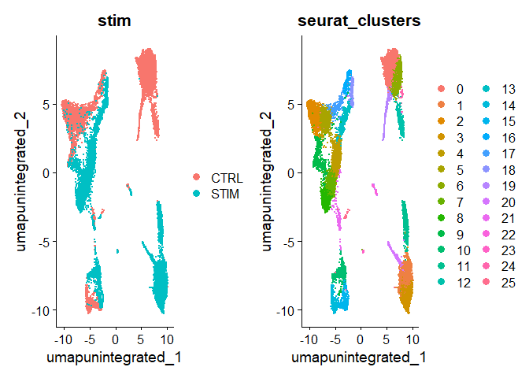
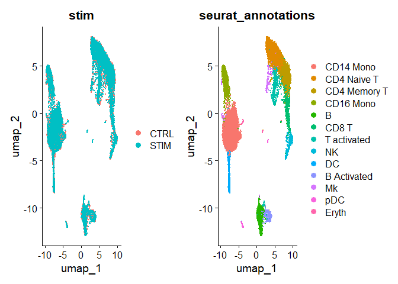
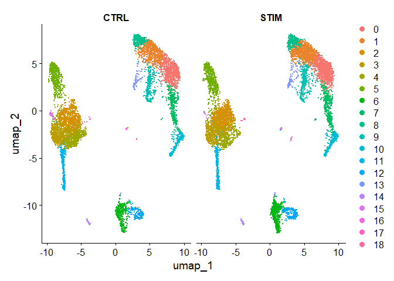
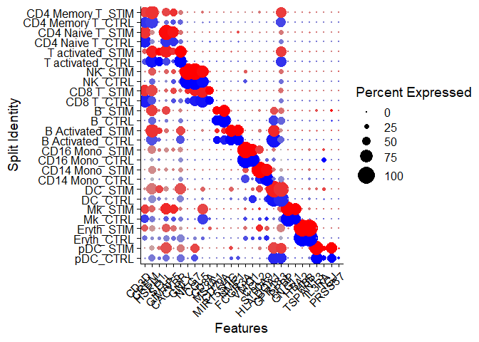
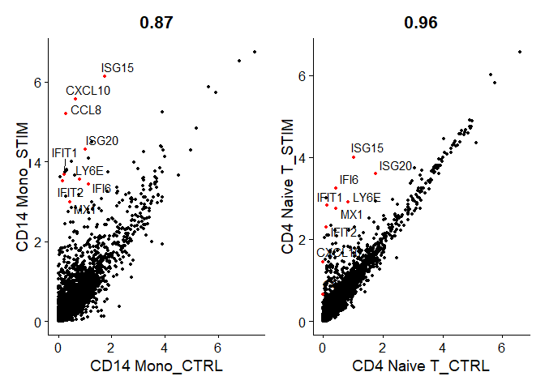
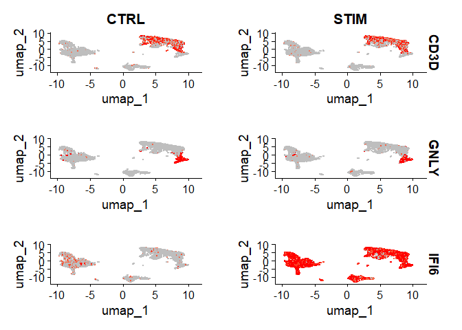
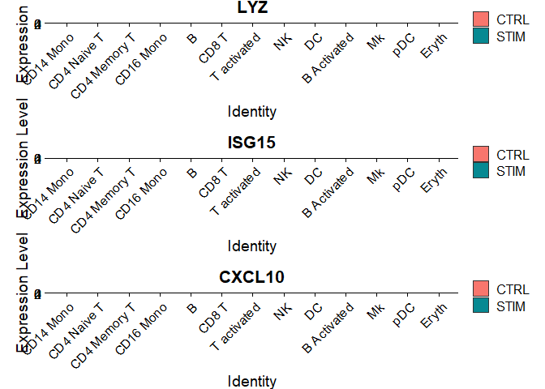

scRNA-seq integration
================
Matthew Esqueda
2024-01-12

## Setup the Seurat objects

``` r
# install dataset
InstallData("ifnb")
```

    ## Warning: The following packages are already installed and will not be
    ## reinstalled: ifnb

The object contains data from human PBMC from two conditions,
interferon-stimulated and control cells.

In Seurat v5, all the data is kept in one object, but split into
multiple layers.

``` r
# load the dataset
ifnb <- LoadData("ifnb")
```

    ## Validating object structure

    ## Updating object slots

    ## Ensuring keys are in the proper structure

    ## Warning: Assay RNA changing from Assay to Assay

    ## Ensuring keys are in the proper structure

    ## Ensuring feature names don't have underscores or pipes

    ## Updating slots in RNA

    ## Validating object structure for Assay 'RNA'

    ## Object representation is consistent with the most current Seurat version

    ## Warning: Assay RNA changing from Assay to Assay5

``` r
# split the RNA measurements into two layers, one for control and one for stimulated cells
ifnb[["RNA"]] <- split(ifnb[["RNA"]], f = ifnb$stim)
ifnb
```

    ## An object of class Seurat 
    ## 14053 features across 13999 samples within 1 assay 
    ## Active assay: RNA (14053 features, 0 variable features)
    ##  4 layers present: counts.CTRL, counts.STIM, data.CTRL, data.STIM

## Perform analysis without integration

``` r
# run standard analysis workflow
ifnb <- NormalizeData(ifnb)
```

    ## Normalizing layer: counts.CTRL

    ## Normalizing layer: counts.STIM

``` r
ifnb <- FindVariableFeatures(ifnb)
```

    ## Finding variable features for layer counts.CTRL

    ## Finding variable features for layer counts.STIM

``` r
ifnb <- ScaleData(ifnb)
```

    ## Centering and scaling data matrix

``` r
ifnb <- RunPCA(ifnb)
```

    ## PC_ 1 
    ## Positive:  TYROBP, C15orf48, FCER1G, CST3, SOD2, ANXA5, FTL, TYMP, TIMP1, CD63 
    ##     LGALS1, CTSB, S100A4, LGALS3, KYNU, PSAP, FCN1, NPC2, ANXA2, S100A11 
    ##     IGSF6, LYZ, SPI1, APOBEC3A, CD68, CTSL, SDCBP, NINJ1, HLA-DRA, CCL2 
    ## Negative:  NPM1, CCR7, GIMAP7, LTB, CD7, SELL, CD2, TMSB4X, TRAT1, IL7R 
    ##     IL32, RHOH, ITM2A, RGCC, LEF1, CD3G, ALOX5AP, CREM, NHP2, PASK 
    ##     MYC, SNHG8, TSC22D3, GPR171, BIRC3, NOP58, RARRES3, CD27, SRM, CD8B 
    ## PC_ 2 
    ## Positive:  ISG15, ISG20, IFIT3, IFIT1, LY6E, TNFSF10, IFIT2, MX1, IFI6, RSAD2 
    ##     CXCL10, OAS1, CXCL11, IFITM3, MT2A, OASL, TNFSF13B, IDO1, IL1RN, APOBEC3A 
    ##     GBP1, CCL8, HERC5, FAM26F, GBP4, HES4, WARS, VAMP5, DEFB1, XAF1 
    ## Negative:  IL8, CLEC5A, CD14, VCAN, S100A8, IER3, MARCKSL1, IL1B, PID1, CD9 
    ##     GPX1, PHLDA1, INSIG1, PLAUR, PPIF, THBS1, OSM, SLC7A11, GAPDH, CTB-61M7.2 
    ##     LIMS1, S100A9, GAPT, CXCL3, ACTB, C19orf59, CEBPB, OLR1, MGST1, FTH1 
    ## PC_ 3 
    ## Positive:  HLA-DQA1, CD83, HLA-DQB1, CD74, HLA-DPA1, HLA-DRA, HLA-DRB1, HLA-DPB1, SYNGR2, IRF8 
    ##     CD79A, MIR155HG, HERPUD1, REL, HLA-DMA, MS4A1, HSP90AB1, FABP5, TVP23A, ID3 
    ##     CCL22, EBI3, TSPAN13, PMAIP1, TCF4, PRMT1, NME1, HSPE1, HSPD1, CD70 
    ## Negative:  ANXA1, GIMAP7, TMSB4X, CD7, CD2, RARRES3, MT2A, IL32, GNLY, PRF1 
    ##     NKG7, CCL5, TRAT1, RGCC, S100A9, KLRD1, CCL2, GZMH, GZMA, CD3G 
    ##     S100A8, CTSW, CCL7, ITM2A, HPSE, FGFBP2, CTSL, GPR171, CCL8, OASL 
    ## PC_ 4 
    ## Positive:  NKG7, GZMB, GNLY, CST7, CCL5, PRF1, CLIC3, KLRD1, GZMH, GZMA 
    ##     APOBEC3G, CTSW, FGFBP2, KLRC1, FASLG, C1orf21, HOPX, CXCR3, SH2D1B, LINC00996 
    ##     TNFRSF18, SPON2, RARRES3, GCHFR, SH2D2A, IGFBP7, ID2, C12orf75, XCL2, RAMP1 
    ## Negative:  CCR7, LTB, SELL, LEF1, IL7R, ADTRP, TRAT1, PASK, MYC, NPM1 
    ##     SOCS3, TSC22D3, TSHZ2, HSP90AB1, SNHG8, GIMAP7, PIM2, HSPD1, CD3G, TXNIP 
    ##     RHOH, GBP1, C12orf57, CA6, PNRC1, CMSS1, CD27, SESN3, NHP2, BIRC3 
    ## PC_ 5 
    ## Positive:  VMO1, FCGR3A, MS4A4A, CXCL16, MS4A7, PPM1N, HN1, LST1, SMPDL3A, ATP1B3 
    ##     CASP5, CDKN1C, CH25H, AIF1, PLAC8, SERPINA1, LRRC25, CD86, HCAR3, GBP5 
    ##     TMSB4X, RP11-290F20.3, RGS19, VNN2, ADA, LILRA5, STXBP2, C3AR1, PILRA, FCGR3B 
    ## Negative:  CCL2, CCL7, CCL8, PLA2G7, LMNA, S100A9, SDS, TXN, CSTB, ATP6V1F 
    ##     CCR1, EMP1, CAPG, CCR5, TPM4, IDO1, MGST1, HPSE, CTSB, LILRB4 
    ##     RSAD2, HSPA1A, VIM, CCNA1, CTSL, GCLM, PDE4DIP, SGTB, SLC7A11, FABP5

``` r
ifnb <- FindNeighbors(ifnb, dims = 1:30, reduction = "pca")
```

    ## Computing nearest neighbor graph

    ## Computing SNN

``` r
ifnb <- FindClusters(ifnb, resolution = 2, cluster.name = "unintegrated_clusters")
```

    ## Modularity Optimizer version 1.3.0 by Ludo Waltman and Nees Jan van Eck
    ## 
    ## Number of nodes: 13999
    ## Number of edges: 555146
    ## 
    ## Running Louvain algorithm...
    ## Maximum modularity in 10 random starts: 0.8153
    ## Number of communities: 26
    ## Elapsed time: 1 seconds

``` r
ifnb <- RunUMAP(ifnb, dims = 1:30, reduction = "pca", reduction.name = "umap.unintegrated")
```

    ## Warning: The default method for RunUMAP has changed from calling Python UMAP via reticulate to the R-native UWOT using the cosine metric
    ## To use Python UMAP via reticulate, set umap.method to 'umap-learn' and metric to 'correlation'
    ## This message will be shown once per session

    ## 13:00:40 UMAP embedding parameters a = 0.9922 b = 1.112

    ## 13:00:40 Read 13999 rows and found 30 numeric columns

    ## 13:00:40 Using Annoy for neighbor search, n_neighbors = 30

    ## 13:00:40 Building Annoy index with metric = cosine, n_trees = 50

    ## 0%   10   20   30   40   50   60   70   80   90   100%

    ## [----|----|----|----|----|----|----|----|----|----|

    ## **************************************************|
    ## 13:00:41 Writing NN index file to temp file C:\Users\matta\AppData\Local\Temp\RtmpiSHM6N\file7f447346eff
    ## 13:00:41 Searching Annoy index using 1 thread, search_k = 3000
    ## 13:00:44 Annoy recall = 100%
    ## 13:00:44 Commencing smooth kNN distance calibration using 1 thread with target n_neighbors = 30
    ## 13:00:45 Initializing from normalized Laplacian + noise (using RSpectra)
    ## 13:00:45 Commencing optimization for 200 epochs, with 614378 positive edges
    ## 13:00:56 Optimization finished

``` r
DimPlot(ifnb, reduction = "umap.unintegrated", group.by = c("stim", "seurat_clusters"))
```

<!-- -->

## Perform integration

Integrate data from the two conditions, so that cells from the same cell
type/sub population will cluster together.

Seurat v5 integration returns a single dimensional reduction that
captures the shared sources of variance across multiple layers, cells in
a similar biological state will cluster. This can be used for
visualization and unsupervised clustering analysis. For evaluating
performance, use cell type labels that are pre-loaded in the
`seurat_annotations` metadata column.

``` r
ifnb <- IntegrateLayers(object = ifnb, method = CCAIntegration, 
                        orig.reduction = "pca", new.reduction = "integrated.cca",
                        verbose = FALSE)

# re-join layers after integration
ifnb[["RNA"]] <- JoinLayers(ifnb[["RNA"]])

ifnb <- FindNeighbors(ifnb, reduction = "integrated.cca", dims = 1:30)
```

    ## Computing nearest neighbor graph

    ## Computing SNN

``` r
ifnb <- FindClusters(ifnb, resolution = 1)
```

    ## Modularity Optimizer version 1.3.0 by Ludo Waltman and Nees Jan van Eck
    ## 
    ## Number of nodes: 13999
    ## Number of edges: 589215
    ## 
    ## Running Louvain algorithm...
    ## Maximum modularity in 10 random starts: 0.8454
    ## Number of communities: 19
    ## Elapsed time: 1 seconds

``` r
ifnb <- RunUMAP(ifnb, dims = 1:30, reduction = "integrated.cca")
```

    ## 13:03:09 UMAP embedding parameters a = 0.9922 b = 1.112

    ## 13:03:09 Read 13999 rows and found 30 numeric columns

    ## 13:03:09 Using Annoy for neighbor search, n_neighbors = 30

    ## 13:03:09 Building Annoy index with metric = cosine, n_trees = 50

    ## 0%   10   20   30   40   50   60   70   80   90   100%

    ## [----|----|----|----|----|----|----|----|----|----|

    ## **************************************************|
    ## 13:03:10 Writing NN index file to temp file C:\Users\matta\AppData\Local\Temp\RtmpiSHM6N\file7f445f6f5f32
    ## 13:03:10 Searching Annoy index using 1 thread, search_k = 3000
    ## 13:03:13 Annoy recall = 100%
    ## 13:03:13 Commencing smooth kNN distance calibration using 1 thread with target n_neighbors = 30
    ## 13:03:14 Initializing from normalized Laplacian + noise (using RSpectra)
    ## 13:03:15 Commencing optimization for 200 epochs, with 629146 positive edges
    ## 13:03:26 Optimization finished

``` r
# visualization
DimPlot(ifnb, reduction = "umap", group.by = c("stim", "seurat_annotations"))
```

<!-- -->

Visualize the conditions side-by-side with `split.by` to show each
condition colored by cluster

``` r
DimPlot(ifnb, reduction = "umap", split.by = "stim")
```

<!-- -->

## Identify conserved cell type markers

`FindConservedMarkers()` performs differential gene expression testing
for each dataset/group and combines the p-values using meta-analysis
methods from the MetaDE R package.

``` r
Idents(ifnb) <- "seurat_annotations"
nk.markers <- FindConservedMarkers(ifnb, ident.1 = "NK", grouping.var = "stim", verbose = FALSE)
head(nk.markers)
```

    ##       CTRL_p_val CTRL_avg_log2FC CTRL_pct.1 CTRL_pct.2 CTRL_p_val_adj
    ## GNLY           0        6.854586      0.943      0.046              0
    ## NKG7           0        5.358881      0.953      0.085              0
    ## GZMB           0        5.078135      0.839      0.044              0
    ## CLIC3          0        5.765314      0.601      0.024              0
    ## CTSW           0        5.307246      0.537      0.030              0
    ## KLRD1          0        5.261553      0.507      0.019              0
    ##       STIM_p_val STIM_avg_log2FC STIM_pct.1 STIM_pct.2 STIM_p_val_adj max_pval
    ## GNLY           0        6.435910      0.956      0.059              0        0
    ## NKG7           0        4.971397      0.950      0.081              0        0
    ## GZMB           0        5.151924      0.897      0.060              0        0
    ## CLIC3          0        5.505208      0.623      0.031              0        0
    ## CTSW           0        5.240729      0.592      0.035              0        0
    ## KLRD1          0        4.852457      0.555      0.027              0        0
    ##       minimump_p_val
    ## GNLY               0
    ## NKG7               0
    ## GZMB               0
    ## CLIC3              0
    ## CTSW               0
    ## KLRD1              0

The `DotPlot()` function with the `split.by` parameter can be useful for
viewing conserved cell type markers across conditions, showing both
expression level and the percentage of cells in a cluster expressing any
given gene.

``` r
# 2-3 strong markers for each of the 14 clusters

# NEEDS TO BE FIXED AND SET ORDER CORRECTLY
Idents(ifnb) <- factor(Idents(ifnb), levels = c("pDC", "Eryth", "Mk", "DC", "CD14 Mono", "CD16 Mono",
    "B Activated", "B", "CD8 T", "NK", "T activated", "CD4 Naive T", "CD4 Memory T"))

markers.to.plot <- c("CD3D", "CREM", "HSPH1", "SELL", "GIMAP5", "CACYBP", "GNLY", "NKG7", "CCL5",
    "CD8A", "MS4A1", "CD79A", "MIR155HG", "NME1", "FCGR3A", "VMO1", "CCL2", "S100A9", "HLA-DQA1",
    "GPR183", "PPBP", "GNG11", "HBA2", "HBB", "TSPAN13", "IL3RA", "IGJ", "PRSS57")
DotPlot(ifnb, features = markers.to.plot, cols = c("blue", "red"), dot.scale = 8, split.by = "stim") +
    RotatedAxis()
```

<!-- -->

## Identify differential expressed genes across conditions

Comparative analyses and differences induced by stimulation.

Aggregate cells of a similar type and condition together to create
“pseudobulk” profiles using the `AggregateExpression` command.

``` r
library(ggplot2)
```

    ## Warning: package 'ggplot2' was built under R version 4.2.3

``` r
library(cowplot)
```

    ## Warning: package 'cowplot' was built under R version 4.2.3

    ## 
    ## Attaching package: 'cowplot'

    ## The following object is masked from 'package:patchwork':
    ## 
    ##     align_plots

``` r
theme_set(theme_cowplot())

aggregate_ifnb <- AggregateExpression(ifnb, group.by = c("seurat_annotations", "stim"), return.seurat = TRUE)
```

    ## Centering and scaling data matrix

``` r
genes.to.label = c("ISG15", "LY6E", "IFI6", "ISG20", "MX1", "IFIT2", "IFIT1", "CXCL10", "CCL8")

p1 <- CellScatter(aggregate_ifnb, "CD14 Mono_CTRL", "CD14 Mono_STIM", highlight = genes.to.label)
```

    ## Warning: The `<scale>` argument of `guides()` cannot be `FALSE`. Use "none" instead as
    ## of ggplot2 3.3.4.
    ## ℹ The deprecated feature was likely used in the Seurat package.
    ##   Please report the issue at <https://github.com/satijalab/seurat/issues>.
    ## This warning is displayed once every 8 hours.
    ## Call `lifecycle::last_lifecycle_warnings()` to see where this warning was
    ## generated.

``` r
p2 <- LabelPoints(plot = p1, points = genes.to.label, repel = TRUE)
```

    ## When using repel, set xnudge and ynudge to 0 for optimal results

``` r
p3 <- CellScatter(aggregate_ifnb, "CD4 Naive T_CTRL", "CD4 Naive T_STIM", highlight = genes.to.label)
p4 <- LabelPoints(plot = p3, points = genes.to.label, repel = TRUE)
```

    ## When using repel, set xnudge and ynudge to 0 for optimal results

``` r
p2 + p4
```

<!-- -->

Look at what genes change in different conditions for cells of the same
type. Create a column in the meta.data slot to hold cell type and stim
info and switch the current ident to that column. Use `FindMarkers()` to
find the genes that are different between the stimulated and control B
cells. Many of the top genes that show up here are the same as the ones
we plotted earlier as core interferon response genes.

``` r
ifnb$celltype.stim <- paste(ifnb$seurat_annotations, ifnb$stim, sep = "_")
Idents(ifnb) <- "celltype.stim"
b.interferon.response <- FindMarkers(ifnb, ident.1 = "B_STIM", ident.2 = "B_CTRL", verbose = FALSE)
head(b.interferon.response, n=15)
```

    ##                 p_val avg_log2FC pct.1 pct.2     p_val_adj
    ## ISG15   5.387767e-159  5.0588481 0.998 0.233 7.571429e-155
    ## IFIT3   1.945114e-154  6.1124940 0.965 0.052 2.733468e-150
    ## IFI6    2.503565e-152  5.4933132 0.965 0.076 3.518260e-148
    ## ISG20   6.492570e-150  3.0549593 1.000 0.668 9.124009e-146
    ## IFIT1   1.951022e-139  6.2320388 0.907 0.029 2.741772e-135
    ## MX1     6.897626e-123  3.9798482 0.905 0.115 9.693234e-119
    ## LY6E    2.825649e-120  3.7907800 0.898 0.150 3.970885e-116
    ## TNFSF10 4.007285e-112  6.5802175 0.786 0.020 5.631437e-108
    ## IFIT2   2.672552e-108  5.5525558 0.786 0.037 3.755738e-104
    ## B2M      5.283684e-98  0.6104044 1.000 1.000  7.425161e-94
    ## PLSCR1   4.634658e-96  3.8010721 0.793 0.113  6.513085e-92
    ## IRF7     2.411149e-94  3.1992949 0.835 0.187  3.388388e-90
    ## CXCL10   3.708508e-86  8.0906108 0.651 0.010  5.211566e-82
    ## UBE2L6   5.547472e-83  2.5167981 0.851 0.297  7.795863e-79
    ## PSMB9    1.716262e-77  1.7715351 0.937 0.568  2.411863e-73

Visualize these changes in gene expression with the `split.by` option on
the `FeaturePlot()` or `VlnPlot()` function.

``` r
FeaturePlot(ifnb, features = c("CD3D", "GNLY", "IFI6"), split.by = "stim", max.cutoff = 3, cols = c("grey", "red"), reduction = "umap")
```

<!-- -->

``` r
plots <- VlnPlot(ifnb, features = c("LYZ", "ISG15", "CXCL10"), split.by = "stim", group.by = "seurat_annotations",
                 pt.size = 0, combine = FALSE)
```

    ## The default behaviour of split.by has changed.
    ## Separate violin plots are now plotted side-by-side.
    ## To restore the old behaviour of a single split violin,
    ## set split.plot = TRUE.
    ##       
    ## This message will be shown once per session.

``` r
wrap_plots(plots = plots, ncol = 1)
```

<!-- -->
