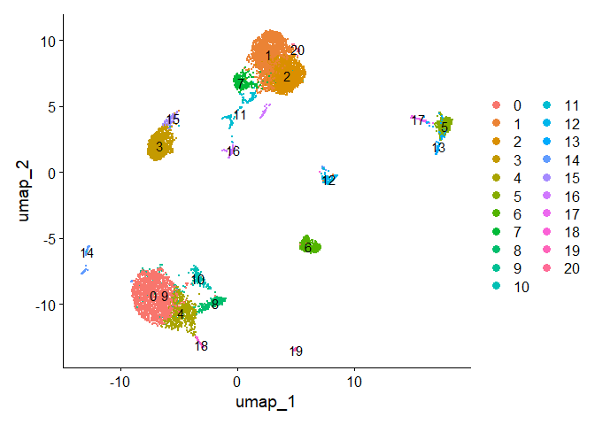
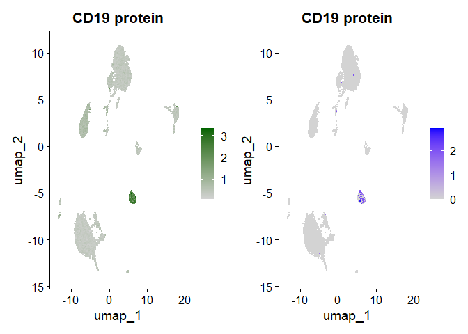
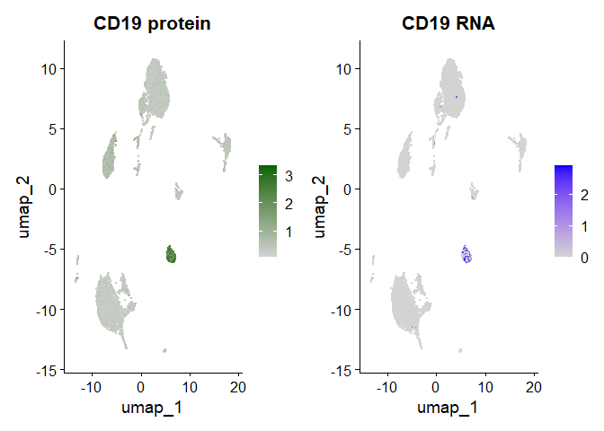
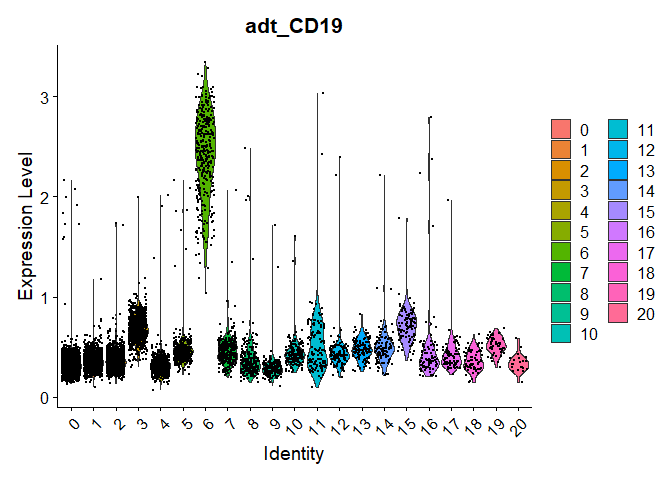
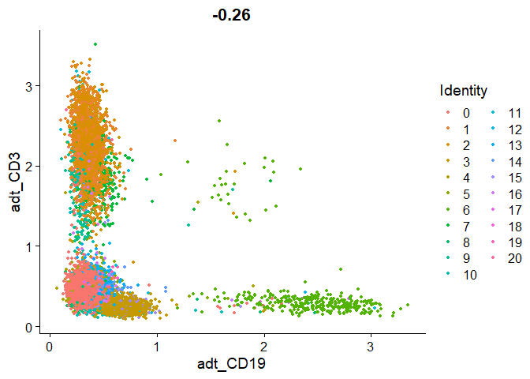
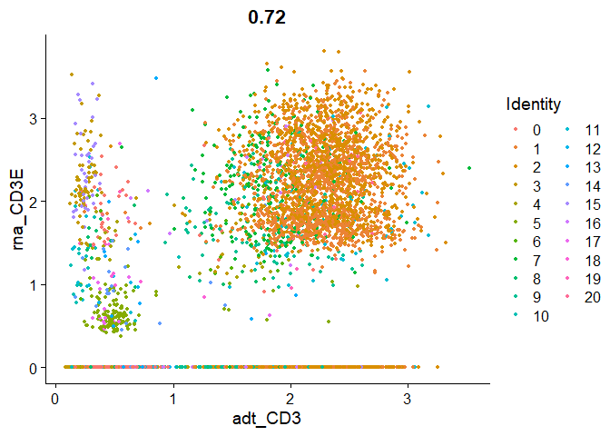
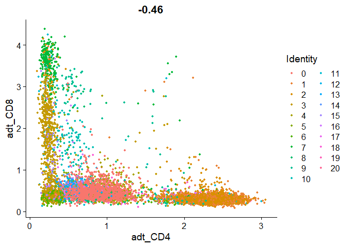
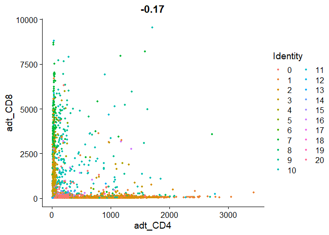

Seurat with multimodal data
================
Matthew Esqueda
2024-01-12

## Load in the data

``` r
# Load in the RNA UMI matrix

# this dataset contains ~5% of mouse cells which can be used as neg controls (i.e. HUMAN_ or MOUSE_ appended to each gene)\
cbmc.rna <- as.sparse(read.csv(file = "GSE100866_CBMC_8K_13AB_10X-RNA_umi.csv.gz", 
                               sep=",", header=TRUE, row.names=1))

# discard all but the top 100 most highly expressed mouse genes, and remove 'HUMAN_' from the CITE-seq prefix
cbmc.rna <- CollapseSpeciesExpressionMatrix(cbmc.rna)

# Load in the ADI UMI Matrix
cbmc.adt <- as.sparse(read.csv(file="GSE100866_CBMC_8K_13AB_10X-ADT_umi.csv.gz",
                               sep=",", header=TRUE, row.names=1))

# the measurements were made in the same cells, the two matrices have identical col names
all.equal(colnames(cbmc.rna), colnames(cbmc.adt))
```

    ## [1] TRUE

## Setup a Seurat object, add the RNA and protein data

``` r
# create a Seurat obj based on the scRNA-seq data
cbmc <- CreateSeuratObject(counts = cbmc.rna)
```

    ## Warning: Feature names cannot have underscores ('_'), replacing with dashes
    ## ('-')

``` r
# the cbmc obj contains an assay storing RNA measurement
Assays(cbmc)
```

    ## [1] "RNA"

``` r
# create a new assay to store ADT info
adt_assay <- CreateAssay5Object(counts = cbmc.adt)

# add this assay to the previously created Seurat obj
cbmc[["ADT"]] <- adt_assay

# validate that the obj now contains multiple assays
Assays(cbmc)
```

    ## [1] "RNA" "ADT"

``` r
# Extract a list of features measured in the ADT assay
rownames(cbmc[["ADT"]])
```

    ##  [1] "CD3"    "CD4"    "CD8"    "CD45RA" "CD56"   "CD16"   "CD10"   "CD11c" 
    ##  [9] "CD14"   "CD19"   "CD34"   "CCR5"   "CCR7"

``` r
# list the current default assay
DefaultAssay(cbmc)
```

    ## [1] "RNA"

``` r
# switch the default to ADT 
DefaultAssay(cbmc) <- "ADT"
DefaultAssay(cbmc)
```

    ## [1] "ADT"

## Cluster cells on the basis of their scRNA-seq profiles

``` r
# verify that the default assay is RNA
DefaultAssay(cbmc) <- "RNA"
DefaultAssay(cbmc)
```

    ## [1] "RNA"

``` r
# perform visualization and clustering steps
cbmc <- NormalizeData(cbmc)
```

    ## Normalizing layer: counts

``` r
cbmc <- FindVariableFeatures(cbmc)
```

    ## Finding variable features for layer counts

``` r
cbmc <- ScaleData(cbmc)
```

    ## Centering and scaling data matrix

``` r
cbmc <- RunPCA(cbmc, verbose = FALSE)
cbmc <- FindNeighbors(cbmc, dims = 1:30)
```

    ## Computing nearest neighbor graph

    ## Computing SNN

``` r
cbmc <- FindClusters(cbmc, resolution = 0.8, verbose = FALSE)
cbmc <- RunUMAP(cbmc, dims = 1:30)
```

    ## Warning: The default method for RunUMAP has changed from calling Python UMAP via reticulate to the R-native UWOT using the cosine metric
    ## To use Python UMAP via reticulate, set umap.method to 'umap-learn' and metric to 'correlation'
    ## This message will be shown once per session

    ## 10:41:12 UMAP embedding parameters a = 0.9922 b = 1.112

    ## 10:41:12 Read 8617 rows and found 30 numeric columns

    ## 10:41:12 Using Annoy for neighbor search, n_neighbors = 30

    ## 10:41:12 Building Annoy index with metric = cosine, n_trees = 50

    ## 0%   10   20   30   40   50   60   70   80   90   100%

    ## [----|----|----|----|----|----|----|----|----|----|

    ## **************************************************|
    ## 10:41:13 Writing NN index file to temp file C:\Users\matta\AppData\Local\Temp\RtmpKmJ2Fd\file74f82b2752a4
    ## 10:41:13 Searching Annoy index using 1 thread, search_k = 3000
    ## 10:41:15 Annoy recall = 100%
    ## 10:41:15 Commencing smooth kNN distance calibration using 1 thread with target n_neighbors = 30
    ## 10:41:16 Initializing from normalized Laplacian + noise (using RSpectra)
    ## 10:41:16 Commencing optimization for 500 epochs, with 385074 positive edges
    ## 10:41:35 Optimization finished

``` r
DimPlot(cbmc, label = TRUE)
```

<!-- -->

## Visualize multiple modalities side-by-side

``` r
# normalize ADT data
DefaultAssay(cbmc) <- "ADT"
cbmc <- NormalizeData(cbmc, normalization.method = "CLR", margin = 2)
```

    ## Normalizing layer: counts

    ## Normalizing across cells

``` r
DefaultAssay(cbmc) <- "RNA"

# alt way to do above
# cbmc <- NormalizeData(cbmc, normalization.method = "CLR", margin = 2, assay = "ADT")

# visualize CD14 levels for RNA and protein 
# by setting the default assay, can visualize one or the other
DefaultAssay(cbmc) <- "ADT"
p1 <- FeaturePlot(cbmc, "CD19", cols = c("lightgrey", "darkgreen")) + ggtitle("CD19 protein")

DefaultAssay(cbmc) <- "RNA"
p2 <- FeaturePlot(cbmc, "CD19") + ggtitle("CD19 protein")

# plots side-by-side
p1 | p2
```

<!-- -->

``` r
# alternately, use specific assay keys to specify a modality
# identify the key for the RNA and protein assays
Key(cbmc[["RNA"]])
```

    ## [1] "rna_"

``` r
Key(cbmc[["ADT"]])
```

    ## [1] "adt_"

``` r
# now we can include the key in the feature name to override the default assay
p1 <- FeaturePlot(cbmc, "adt_CD19", cols = c("lightgrey", "darkgreen")) + ggtitle("CD19 protein")
p2 <- FeaturePlot(cbmc, "rna_CD19") + ggtitle("CD19 RNA")
p1 | p2
```

<!-- -->

## Identify cell surface markers for scRNA-seq clusters

Leverage the paired CITE-seq measurements to help annotate clusters
derived from scRNA-seq and identify both protein and RNA markers

``` r
# CD19 is a B cell marker, so identify cluster 6 as expressing CD19 on the surface
VlnPlot(cbmc, "adt_CD19")
```

<!-- -->

``` r
# also identify alternative protein and RNA markers for this cluster through differential expression
adt_markers <- FindMarkers(cbmc, ident.1 = 6, assay = "ADT")
rna_markers <- FindMarkers(cbmc, ident.1 = 6, assay = "RNA")

head(adt_markers)
```

    ##                p_val avg_log2FC pct.1 pct.2     p_val_adj
    ## CD19   2.067533e-215  2.5741873     1     1 2.687793e-214
    ## CD45RA 8.108073e-109  0.5300346     1     1 1.054049e-107
    ## CD4    1.123162e-107 -1.6707420     1     1 1.460110e-106
    ## CD14   7.212876e-106 -1.0332070     1     1 9.376739e-105
    ## CD3     1.639633e-87 -1.5823056     1     1  2.131523e-86
    ## CCR5    2.552859e-63  0.3753989     1     1  3.318716e-62

``` r
head(rna_markers)
```

    ##       p_val avg_log2FC pct.1 pct.2 p_val_adj
    ## IGHM      0   6.660187 0.977 0.044         0
    ## CD79A     0   6.748356 0.965 0.045         0
    ## TCL1A     0   7.428099 0.904 0.028         0
    ## CD79B     0   5.525568 0.944 0.089         0
    ## IGHD      0   7.811884 0.857 0.015         0
    ## MS4A1     0   7.523215 0.851 0.016         0

## Additional visualizations of multimodal data

``` r
# draw ADT scatter plots 
FeatureScatter(cbmc, feature1 = "adt_CD19", feature2 = "adt_CD3")
```

<!-- -->

``` r
# view relationship between protein and RNA
FeatureScatter(cbmc, feature1 = "adt_CD3", feature2 = "rna_CD3E")
```

<!-- -->

``` r
FeatureScatter(cbmc, feature1 = "adt_CD4", feature2 = "adt_CD8")
```

<!-- -->

``` r
# raw (non-normalized) ADT counts, values are quite high, particularly in comparison to RNA values. This is due to the significantly higher protein copy number in cells which reduced 'drop-out' in ADT data
FeatureScatter(cbmc, feature1 = "adt_CD4", feature2 = "adt_CD8", slot = "counts")
```

<!-- -->

``` r
plot <- FeatureScatter(cbmc, feature1 = "adt_CD19", feature2 = "adt_CD3") + NoLegend() + theme(axis.title = element_text(size = 18),
    legend.text = element_text(size = 18))
ggsave(filename = "../output/images/citeseq_plot.jpg", height = 7, width = 12, plot = plot, quality = 50)
```
