pbmc3k_UMAP
================
Matthew Esqueda
2024-01-13

# Guided Clustering

## Setup the Seurat Object

``` r
# Load the PMBC dataset
pbmc.data <- Read10X(data.dir = "filtered_gene_bc_matrices/hg19/")

# Initialize the Seurat object with the raw data (pre-Normalization)
pbmc <- CreateSeuratObject(counts = pbmc.data, project = "pbmc3k", min.cells = 3, min.features = 200)
```

    ## Warning: Feature names cannot have underscores ('_'), replacing with dashes
    ## ('-')

``` r
pbmc
```

    ## An object of class Seurat 
    ## 13714 features across 2700 samples within 1 assay 
    ## Active assay: RNA (13714 features, 0 variable features)
    ##  1 layer present: counts

``` r
# Examine a few genes in the first 30 cells
pbmc.data[c("CD3D", "TCL1A", "MS4A1"), 1:30] # . values in the matrix represent 0s (no molecules detected)
```

    ## 3 x 30 sparse Matrix of class "dgCMatrix"

    ##   [[ suppressing 30 column names 'AAACATACAACCAC-1', 'AAACATTGAGCTAC-1', 'AAACATTGATCAGC-1' ... ]]

    ##                                                                    
    ## CD3D  4 . 10 . . 1 2 3 1 . . 2 7 1 . . 1 3 . 2  3 . . . . . 3 4 1 5
    ## TCL1A . .  . . . . . . 1 . . . . . . . . . . .  . 1 . . . . . . . .
    ## MS4A1 . 6  . . . . . . 1 1 1 . . . . . . . . . 36 1 2 . . 2 . . . .

``` r
dense.size <- object.size(as.matrix(pbmc.data))
dense.size
```

    ## 709591472 bytes

``` r
sparse.size <- object.size(pbmc.data)
sparse.size
```

    ## 29905192 bytes

``` r
dense.size/sparse.size
```

    ## 23.7 bytes

## Standard pre-processing workflow

### QC and selecting cells for further analysis

#### -number of unque genese detected in each cell

#### -total number of molecules detected within a cell

#### -% of reads that map to the mitochondrial genome

``` r
# Add QC stats to object metadata
pbmc[["percent.mt"]] <- PercentageFeatureSet(pbmc, pattern = "^MT-")

# Show QC metrics for the first 5 cells
head(pbmc@meta.data, 5)
```

    ##                  orig.ident nCount_RNA nFeature_RNA percent.mt
    ## AAACATACAACCAC-1     pbmc3k       2419          779  3.0177759
    ## AAACATTGAGCTAC-1     pbmc3k       4903         1352  3.7935958
    ## AAACATTGATCAGC-1     pbmc3k       3147         1129  0.8897363
    ## AAACCGTGCTTCCG-1     pbmc3k       2639          960  1.7430845
    ## AAACCGTGTATGCG-1     pbmc3k        980          521  1.2244898

``` r
# Visualize QC metrics as a violin plot
VlnPlot(pbmc, features = c("nFeature_RNA", "nCount_RNA", "percent.mt"), ncol = 3)
```

    ## Warning: Default search for "data" layer in "RNA" assay yielded no results;
    ## utilizing "counts" layer instead.

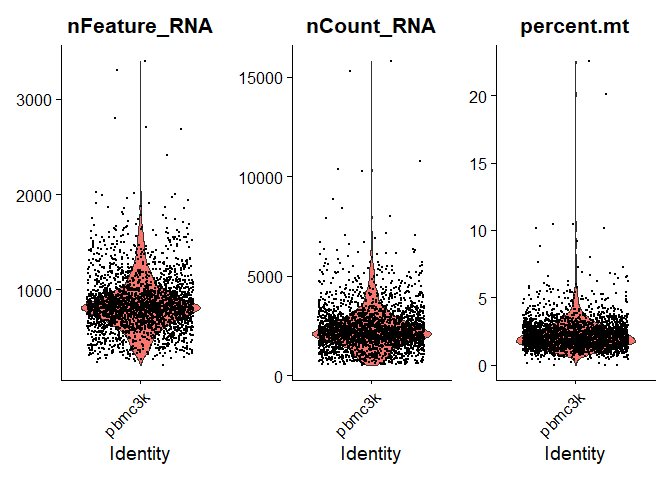<!-- -->

``` r
# FeatureScatter is typically used to visualize feature-feature relationships, but can be used for anything calculated by the object
plot1 <- FeatureScatter(pbmc, feature1 = "nCount_RNA", feature2 = "percent.mt")
plot2 <- FeatureScatter(pbmc, feature1 = "nCount_RNA", feature2 = "nFeature_RNA")
plot1 + plot2
```

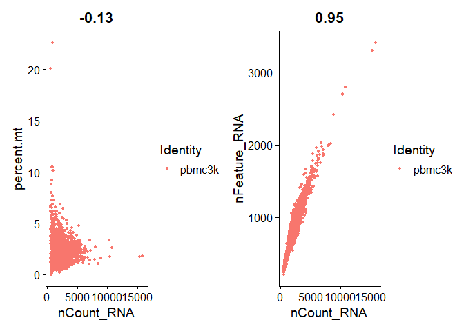<!-- -->

``` r
pbmc <- subset(pbmc, subset = nFeature_RNA > 200 & nFeature_RNA < 2500 & percent.mt < 5)
pbmc
```

    ## An object of class Seurat 
    ## 13714 features across 2638 samples within 1 assay 
    ## Active assay: RNA (13714 features, 0 variable features)
    ##  1 layer present: counts

## Normalizing the data

``` r
pbmc <- NormalizeData(pbmc, normalization.method = "LogNormalize", scale.factor = 10000)
```

    ## Normalizing layer: counts

``` r
# same as pbmc <- NormalizeData(pbmc)
```

## Identification of highly variable features (feature selection)

``` r
pbmc <- FindVariableFeatures(pbmc, selection.method = "vst", nfeatures = 2000)
```

    ## Finding variable features for layer counts

``` r
# Identify the 10 most highly variable genes
top10 <- head(VariableFeatures(pbmc), 10)

# Plot variable features with and without labels
plot1 <- VariableFeaturePlot(pbmc)
plot2 <- LabelPoints(plot = plot1, points = top10, repel = TRUE)
```

    ## When using repel, set xnudge and ynudge to 0 for optimal results

``` r
plot1 + plot2
```

    ## Warning: Transformation introduced infinite values in continuous x-axis
    ## Transformation introduced infinite values in continuous x-axis

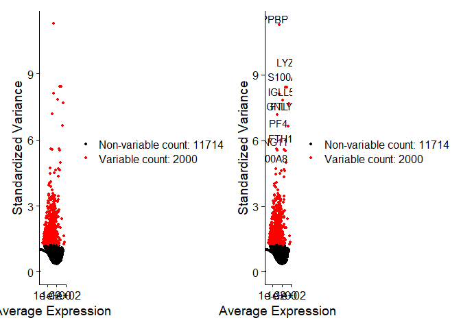<!-- -->

## Scaling the data

``` r
all.genes <- rownames(pbmc)
pbmc <- ScaleData(pbmc, features = all.genes)
```

    ## Centering and scaling data matrix

## Perform linear dimensional reduction

``` r
pbmc <- RunPCA(pbmc, features = VariableFeatures(object = pbmc))
```

    ## PC_ 1 
    ## Positive:  CST3, TYROBP, LST1, AIF1, FTL, FTH1, LYZ, FCN1, S100A9, TYMP 
    ##     FCER1G, CFD, LGALS1, S100A8, CTSS, LGALS2, SERPINA1, IFITM3, SPI1, CFP 
    ##     PSAP, IFI30, SAT1, COTL1, S100A11, NPC2, GRN, LGALS3, GSTP1, PYCARD 
    ## Negative:  MALAT1, LTB, IL32, IL7R, CD2, B2M, ACAP1, CD27, STK17A, CTSW 
    ##     CD247, GIMAP5, AQP3, CCL5, SELL, TRAF3IP3, GZMA, MAL, CST7, ITM2A 
    ##     MYC, GIMAP7, HOPX, BEX2, LDLRAP1, GZMK, ETS1, ZAP70, TNFAIP8, RIC3 
    ## PC_ 2 
    ## Positive:  CD79A, MS4A1, TCL1A, HLA-DQA1, HLA-DQB1, HLA-DRA, LINC00926, CD79B, HLA-DRB1, CD74 
    ##     HLA-DMA, HLA-DPB1, HLA-DQA2, CD37, HLA-DRB5, HLA-DMB, HLA-DPA1, FCRLA, HVCN1, LTB 
    ##     BLNK, P2RX5, IGLL5, IRF8, SWAP70, ARHGAP24, FCGR2B, SMIM14, PPP1R14A, C16orf74 
    ## Negative:  NKG7, PRF1, CST7, GZMB, GZMA, FGFBP2, CTSW, GNLY, B2M, SPON2 
    ##     CCL4, GZMH, FCGR3A, CCL5, CD247, XCL2, CLIC3, AKR1C3, SRGN, HOPX 
    ##     TTC38, APMAP, CTSC, S100A4, IGFBP7, ANXA1, ID2, IL32, XCL1, RHOC 
    ## PC_ 3 
    ## Positive:  HLA-DQA1, CD79A, CD79B, HLA-DQB1, HLA-DPB1, HLA-DPA1, CD74, MS4A1, HLA-DRB1, HLA-DRA 
    ##     HLA-DRB5, HLA-DQA2, TCL1A, LINC00926, HLA-DMB, HLA-DMA, CD37, HVCN1, FCRLA, IRF8 
    ##     PLAC8, BLNK, MALAT1, SMIM14, PLD4, LAT2, IGLL5, P2RX5, SWAP70, FCGR2B 
    ## Negative:  PPBP, PF4, SDPR, SPARC, GNG11, NRGN, GP9, RGS18, TUBB1, CLU 
    ##     HIST1H2AC, AP001189.4, ITGA2B, CD9, TMEM40, PTCRA, CA2, ACRBP, MMD, TREML1 
    ##     NGFRAP1, F13A1, SEPT5, RUFY1, TSC22D1, MPP1, CMTM5, RP11-367G6.3, MYL9, GP1BA 
    ## PC_ 4 
    ## Positive:  HLA-DQA1, CD79B, CD79A, MS4A1, HLA-DQB1, CD74, HLA-DPB1, HIST1H2AC, PF4, TCL1A 
    ##     SDPR, HLA-DPA1, HLA-DRB1, HLA-DQA2, HLA-DRA, PPBP, LINC00926, GNG11, HLA-DRB5, SPARC 
    ##     GP9, AP001189.4, CA2, PTCRA, CD9, NRGN, RGS18, GZMB, CLU, TUBB1 
    ## Negative:  VIM, IL7R, S100A6, IL32, S100A8, S100A4, GIMAP7, S100A10, S100A9, MAL 
    ##     AQP3, CD2, CD14, FYB, LGALS2, GIMAP4, ANXA1, CD27, FCN1, RBP7 
    ##     LYZ, S100A11, GIMAP5, MS4A6A, S100A12, FOLR3, TRABD2A, AIF1, IL8, IFI6 
    ## PC_ 5 
    ## Positive:  GZMB, NKG7, S100A8, FGFBP2, GNLY, CCL4, CST7, PRF1, GZMA, SPON2 
    ##     GZMH, S100A9, LGALS2, CCL3, CTSW, XCL2, CD14, CLIC3, S100A12, CCL5 
    ##     RBP7, MS4A6A, GSTP1, FOLR3, IGFBP7, TYROBP, TTC38, AKR1C3, XCL1, HOPX 
    ## Negative:  LTB, IL7R, CKB, VIM, MS4A7, AQP3, CYTIP, RP11-290F20.3, SIGLEC10, HMOX1 
    ##     PTGES3, LILRB2, MAL, CD27, HN1, CD2, GDI2, ANXA5, CORO1B, TUBA1B 
    ##     FAM110A, ATP1A1, TRADD, PPA1, CCDC109B, ABRACL, CTD-2006K23.1, WARS, VMO1, FYB

``` r
# Examine and visualize PCA results 
print(pbmc[["pca"]], dims = 1:5, nfeatures = 5)
```

    ## PC_ 1 
    ## Positive:  CST3, TYROBP, LST1, AIF1, FTL 
    ## Negative:  MALAT1, LTB, IL32, IL7R, CD2 
    ## PC_ 2 
    ## Positive:  CD79A, MS4A1, TCL1A, HLA-DQA1, HLA-DQB1 
    ## Negative:  NKG7, PRF1, CST7, GZMB, GZMA 
    ## PC_ 3 
    ## Positive:  HLA-DQA1, CD79A, CD79B, HLA-DQB1, HLA-DPB1 
    ## Negative:  PPBP, PF4, SDPR, SPARC, GNG11 
    ## PC_ 4 
    ## Positive:  HLA-DQA1, CD79B, CD79A, MS4A1, HLA-DQB1 
    ## Negative:  VIM, IL7R, S100A6, IL32, S100A8 
    ## PC_ 5 
    ## Positive:  GZMB, NKG7, S100A8, FGFBP2, GNLY 
    ## Negative:  LTB, IL7R, CKB, VIM, MS4A7

``` r
VizDimLoadings(pbmc, dims = 1:2, reduction = "pca")
```

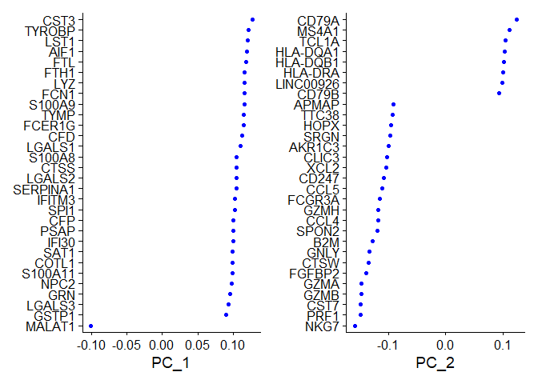<!-- -->

``` r
DimPlot(pbmc, reduction = "pca" + NoLegend())
```

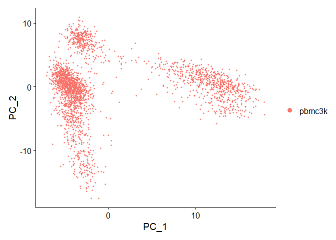<!-- -->

``` r
DimHeatmap(pbmc, dims = 1, cells = 500, balanced = TRUE)
```

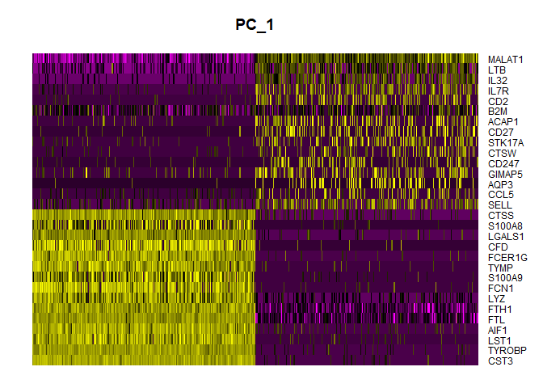<!-- -->

``` r
DimHeatmap(pbmc, dims = 1:15, cells = 500, balanced = TRUE)
```

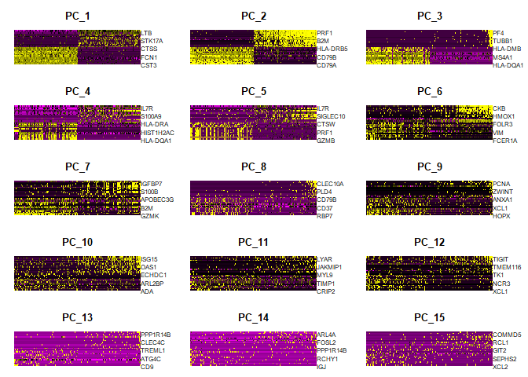<!-- -->

## Determine the ‘dimensionality’ of the dataset

``` r
ElbowPlot(pbmc) # choose top 10 PCs as cutoff based on graph
```

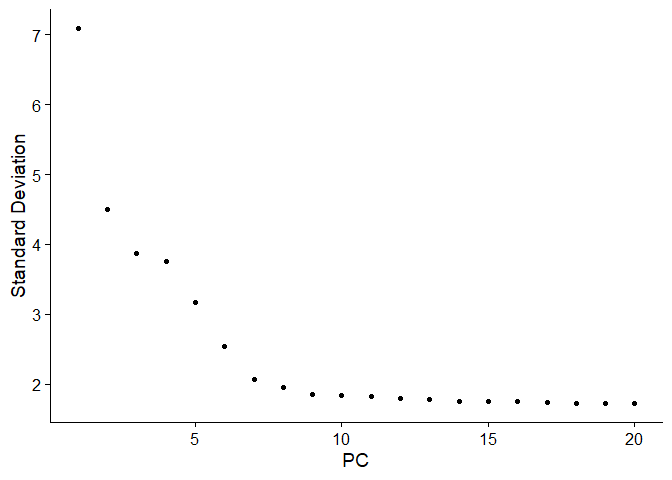<!-- -->

## Cluster the cells

``` r
pbmc <- FindNeighbors(pbmc, dims = 1:10)
```

    ## Computing nearest neighbor graph

    ## Computing SNN

``` r
pbmc <- FindClusters(pbmc, resolution = 0.5)
```

    ## Modularity Optimizer version 1.3.0 by Ludo Waltman and Nees Jan van Eck
    ## 
    ## Number of nodes: 2638
    ## Number of edges: 95965
    ## 
    ## Running Louvain algorithm...
    ## Maximum modularity in 10 random starts: 0.8723
    ## Number of communities: 9
    ## Elapsed time: 0 seconds

``` r
# Look at cluster IDs of the first 5 cells
head(Idents(pbmc), 5)
```

    ## AAACATACAACCAC-1 AAACATTGAGCTAC-1 AAACATTGATCAGC-1 AAACCGTGCTTCCG-1 
    ##                2                3                2                1 
    ## AAACCGTGTATGCG-1 
    ##                6 
    ## Levels: 0 1 2 3 4 5 6 7 8

### Run non-linear dimensional reduction (UMAP/tSNE)

``` r
pbmc <- RunUMAP(pbmc, dims = 1:10)
```

    ## Warning: The default method for RunUMAP has changed from calling Python UMAP via reticulate to the R-native UWOT using the cosine metric
    ## To use Python UMAP via reticulate, set umap.method to 'umap-learn' and metric to 'correlation'
    ## This message will be shown once per session

    ## 15:04:20 UMAP embedding parameters a = 0.9922 b = 1.112

    ## 15:04:20 Read 2638 rows and found 10 numeric columns

    ## 15:04:20 Using Annoy for neighbor search, n_neighbors = 30

    ## 15:04:20 Building Annoy index with metric = cosine, n_trees = 50

    ## 0%   10   20   30   40   50   60   70   80   90   100%

    ## [----|----|----|----|----|----|----|----|----|----|

    ## **************************************************|
    ## 15:04:20 Writing NN index file to temp file C:\Users\matta\AppData\Local\Temp\RtmpCivPZ7\file2d2835e653a5
    ## 15:04:20 Searching Annoy index using 1 thread, search_k = 3000
    ## 15:04:20 Annoy recall = 100%
    ## 15:04:21 Commencing smooth kNN distance calibration using 1 thread with target n_neighbors = 30
    ## 15:04:22 Initializing from normalized Laplacian + noise (using RSpectra)
    ## 15:04:22 Commencing optimization for 500 epochs, with 105124 positive edges
    ## 15:04:27 Optimization finished

``` r
DimPlot(pbmc, reduction = "umap")
```

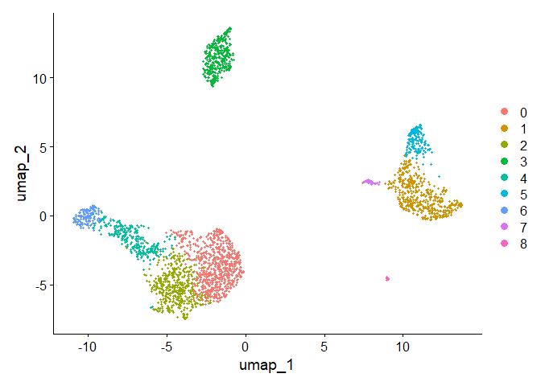<!-- -->

``` r
saveRDS(pbmc, file = "./output/pbmc_tutorial_umap.rds")
```

## Finding differntially expressed features (cluster biomarkers)

``` r
# Find all markers of cluster 2
cluster2.markers <- FindMarkers(pbmc, ident.1 = 2)
head(cluster2.markers, n = 5)
```

    ##             p_val avg_log2FC pct.1 pct.2    p_val_adj
    ## IL32 2.593535e-91  1.3221171 0.949 0.466 3.556774e-87
    ## LTB  7.994465e-87  1.3450377 0.981 0.644 1.096361e-82
    ## CD3D 3.922451e-70  1.0562099 0.922 0.433 5.379250e-66
    ## IL7R 1.130870e-66  1.4256944 0.748 0.327 1.550876e-62
    ## LDHB 4.082189e-65  0.9765875 0.953 0.614 5.598314e-61

``` r
# Find all markers distinguishing cluster 5 from clusters 0 and 3
cluster5.markers <- FindMarkers(pbmc, ident.1 = 5, ident.2 = c(0,3))
head(cluster5.markers, n = 5)
```

    ##                       p_val avg_log2FC pct.1 pct.2     p_val_adj
    ## FCGR3A        2.150929e-209   6.832372 0.975 0.039 2.949784e-205
    ## IFITM3        6.103366e-199   6.181000 0.975 0.048 8.370156e-195
    ## CFD           8.891428e-198   6.052575 0.938 0.037 1.219370e-193
    ## CD68          2.374425e-194   5.493138 0.926 0.035 3.256286e-190
    ## RP11-290F20.3 9.308287e-191   6.335402 0.840 0.016 1.276538e-186

``` r
# Find markers for every cluster compared to all remaining cells, report only positive ones
pbmc.markers <- FindAllMarkers(pbmc, only.pos = TRUE)
```

    ## Calculating cluster 0

    ## Calculating cluster 1

    ## Calculating cluster 2

    ## Calculating cluster 3

    ## Calculating cluster 4

    ## Calculating cluster 5

    ## Calculating cluster 6

    ## Calculating cluster 7

    ## Calculating cluster 8

``` r
pbmc.markers %>%
  group_by(cluster) %>%
  dplyr::filter(avg_log2FC > 1)
```

    ## # A tibble: 7,046 × 7
    ## # Groups:   cluster [9]
    ##        p_val avg_log2FC pct.1 pct.2 p_val_adj cluster gene     
    ##        <dbl>      <dbl> <dbl> <dbl>     <dbl> <fct>   <chr>    
    ##  1 1.74e-109       1.19 0.897 0.593 2.39e-105 0       LDHB     
    ##  2 1.17e- 83       2.37 0.435 0.108 1.60e- 79 0       CCR7     
    ##  3 8.94e- 79       1.09 0.838 0.403 1.23e- 74 0       CD3D     
    ##  4 3.05e- 53       1.02 0.722 0.399 4.19e- 49 0       CD3E     
    ##  5 3.28e- 49       2.10 0.333 0.103 4.50e- 45 0       LEF1     
    ##  6 6.66e- 49       1.25 0.623 0.358 9.13e- 45 0       NOSIP    
    ##  7 9.31e- 44       2.02 0.328 0.11  1.28e- 39 0       PRKCQ-AS1
    ##  8 4.69e- 43       1.53 0.435 0.184 6.43e- 39 0       PIK3IP1  
    ##  9 1.47e- 39       2.70 0.195 0.04  2.01e- 35 0       FHIT     
    ## 10 2.44e- 33       1.94 0.262 0.087 3.34e- 29 0       MAL      
    ## # ℹ 7,036 more rows

``` r
cluster0.markers <- FindMarkers(pbmc, ident.1 = 0, logfc.threshold = 0.25, test.use = "roc", only.pos = TRUE)

VlnPlot(pbmc, features = c("MS4A1", "CD79A"))
```

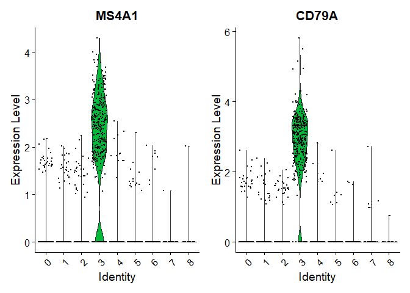<!-- -->

``` r
# plot raw counts as well
VlnPlot(pbmc, features = c("NKG7", "PF4"), slot = "counts", log = TRUE)
```

    ## Warning: The `slot` argument of `VlnPlot()` is deprecated as of Seurat 5.0.0.
    ## ℹ Please use the `layer` argument instead.
    ## This warning is displayed once every 8 hours.
    ## Call `lifecycle::last_lifecycle_warnings()` to see where this warning was
    ## generated.

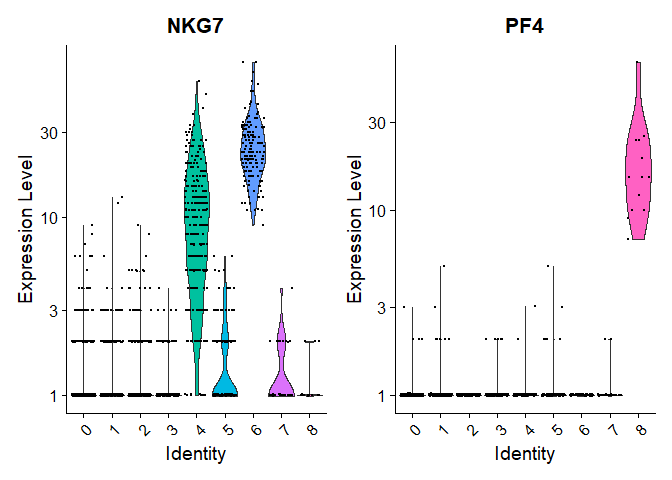<!-- -->

``` r
FeaturePlot(pbmc, features = c("MS4A1", "GNLY", "CD3E", "CD14", "FCER1A", "FCGR3A", "LYZ", "PPBP",
    "CD8A"))
```

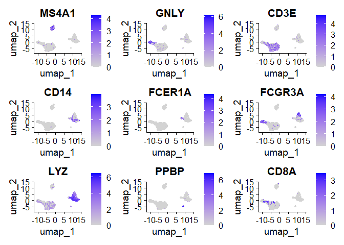<!-- -->

``` r
pbmc.markers %>%
  group_by(cluster) %>%
  dplyr::filter(avg_log2FC > 1) %>%
  slice_head(n = 10) %>%
  ungroup() -> top10
DoHeatmap(pbmc, features = top10$gene) + NoLegend()
```

<!-- -->

## Assigning cell type idenity to clusters

``` r
new.cluster.ids <- c("Naive CD4 T", "CD14+ Mono", "Memory CD4 T", "B", "CD8 T", "FCGR3A+ Mono",
    "NK", "DC", "Platelet")
names(new.cluster.ids) <- levels(pbmc)
pbmc <- RenameIdents(pbmc, new.cluster.ids)
DimPlot(pbmc, reduction = "umap", label = TRUE, pt.size = 0.5) + NoLegend()
```

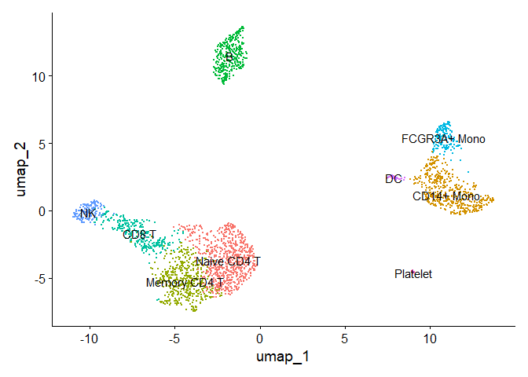<!-- -->

``` r
library(ggplot2)
```

    ## Warning: package 'ggplot2' was built under R version 4.2.3

``` r
plot <- DimPlot(pbmc, reduction = "umap", label = TRUE, label.size = 4.5) + xlab("UMAP 1") + ylab("UMAP 2") +
    theme(axis.title = element_text(size = 18), legend.text = element_text(size = 18)) + guides(colour = guide_legend(override.aes = list(size = 10)))
ggsave(filename = "./output/images/pbmc3k_umap.jpg", height = 7, width = 12, plot = plot, quality = 50)      

saveRDS(pbmc, file = "./output/pbmc3k_final.rds")
```
