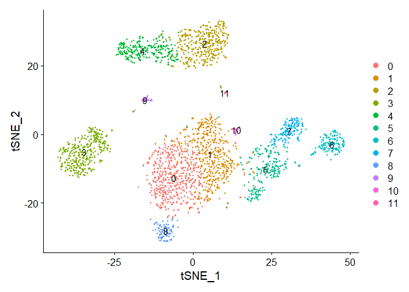
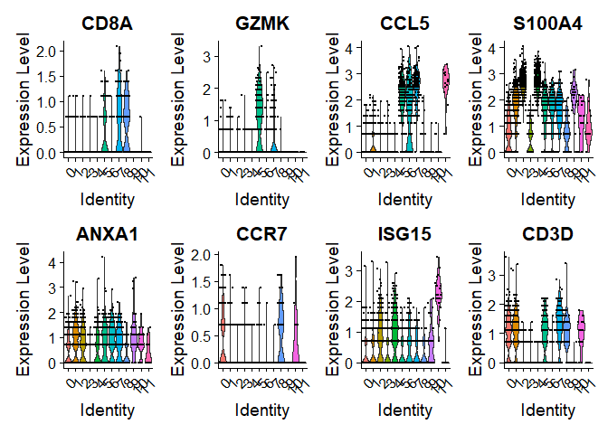
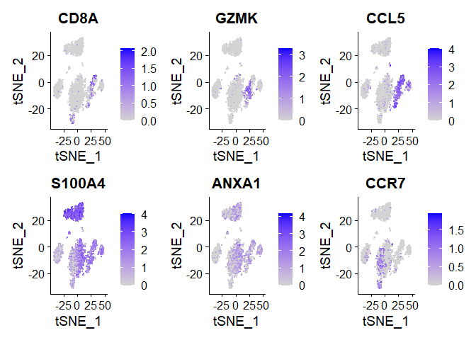
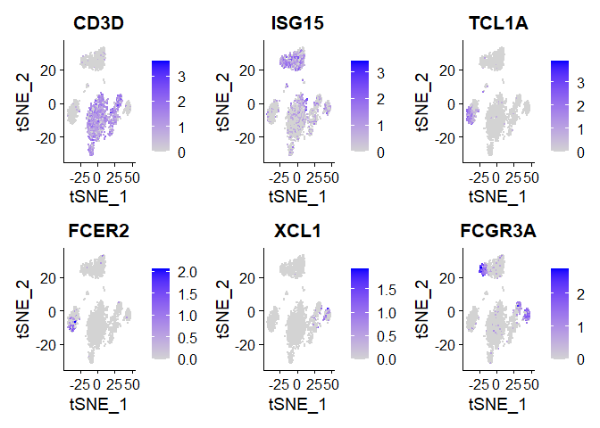

sctransform
================
Matthew Esqueda
2024-01-11

# Using sctransform in Seurat

## Load data and create Seurat object

``` r
pbmc_data <- Read10X(data.dir="./pbmc3k/filtered_gene_bc_matrices/hg19/")
pbmc <- CreateSeuratObject(counts = pbmc_data)
```

    ## Warning: Feature names cannot have underscores ('_'), replacing with dashes
    ## ('-')

    ## Warning: Feature names cannot have underscores ('_'), replacing with dashes
    ## ('-')

## Apply sctransform normalization

``` r
# store MT percentage in object meta data
pbmc <- PercentageFeatureSet(pbmc, pattern = "^MT-", col.name = "percent.mt")

# run sctransform
pbmc <- SCTransform(pbmc, vars.to.regress = "percent.mt", verbose = FALSE)
```

## Perform dimensionality reduction by PCA and UMAP embedding

``` r
# Standard steps in Seurat workflow for visualization and clustering
pbmc <- RunPCA(pbmc, verbose = FALSE)
pbmc <- RunTSNE(pbmc, dims = 1:30, verbose = FALSE)
# used RunTSNE for dimensionality reduction because of: 
# Error in irlba::irlba(L, nv = n, nu = 0, maxit = iters) : 
#  function 'as_cholmod_sparse' not provided by package 'Matrix'

pbmc <- FindNeighbors(pbmc, dims = 1:30, verbose = FALSE)
pbmc <- FindClusters(pbmc, verbose = FALSE)
DimPlot(pbmc, label = TRUE)
```

<!-- -->

``` r
# Visualize canonical marker genes as violin plots
VlnPlot(pbmc, features = c("CD8A", "GZMK", "CCL5", "S100A4", "ANXA1", "CCR7", "ISG15", "CD3D"),
    pt.size = 0.2, ncol = 4)
```

<!-- -->

``` r
# Visualize canonical marker genes on the sctransform embedding
FeaturePlot(pbmc, features = c("CD8A", "GZMK", "CCL5", "S100A4", "ANXA1", "CCR7"), pt.size = 0.2,
    ncol = 3)
```

<!-- -->

``` r
FeaturePlot(pbmc, features = c("CD3D", "ISG15", "TCL1A", "FCER2", "XCL1", "FCGR3A"), pt.size = 0.2,
    ncol = 3)
```

<!-- -->
